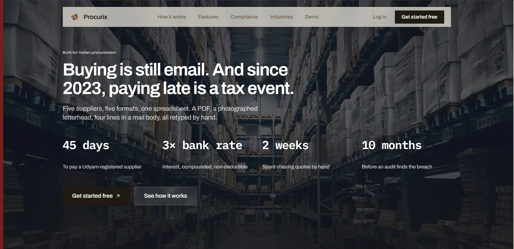

<div align="center">

<h1>Procurix</h1>

<h3>Say what you need to buy. It does the rest.</h3>

<p>
It emails your suppliers, reads their quotes — PDFs, photographs, four lines typed in a reply —<br>
ranks them on <i>your</i> terms, and then watches the clock, because in India<br>
paying a small supplier late now costs you the tax deduction.
</p>

<p>


</p>

<br>

<p>
Built for <b>WCC Launchpad 30</b> — <b>Track 01: Agentic AI</b><br>
<b>Nikhil Yadav</b>
</p>

<p>
<a href="https://youtu.be/RJX_FI9l3qs?si=I5yuxpQMb1CJMzr9"><b>▶ Watch Demo</b></a> &nbsp;·&nbsp;
<a href="docs/Procurix-Presentation.html"><b>Problem & Architecture Deck</b></a> &nbsp;·&nbsp;
<a href="docs/TECHNICAL.md"><b>Technical Documentation</b></a>
</p>

<br>

<a href="https://youtu.be/RJX_FI9l3qs?si=I5yuxpQMb1CJMzr9">
  
</a>

</div>

---

## The problem

Two problems live in the same inbox.

**Buying is still email.** A firm needs 250 desks. Someone writes to five suppliers. Replies come back over a fortnight — one a PDF, one a photograph of a letterhead, one four lines typed into the message body. Someone retypes it all into a spreadsheet, gives up on comparing payment terms properly, and picks a number. The reason for the choice leaves with the inbox.

**And since 2023, paying late is a tax event.** Section 43B(h) of the Income Tax Act: if you do not pay a Udyam-registered micro or small supplier within the agreed term — 45 days maximum, 15 if nothing was agreed in writing — you cannot deduct that expense this year. It moves to the year you actually pay, plus interest at three times the RBI bank rate, compounded monthly, which is itself not deductible.

Nothing happens on day 46. Most firms find out at audit, ten months later, when nothing can be done.

---

## What it does

One chat box runs the whole loop.

| Step | What happens |
|------|--------------|
| **1. You describe it** | "I need 250 workstation desks, get quotes from Kumar, Rapid and Godrej" |
| **2. RFP drafted and sent** | Written, numbered, turned into a PDF, emailed from your own Gmail |
| **3. Quotes read from email** | It reads PDFs *and photographs* — price, delivery, terms, warranty, line items |
| **4. Ranked on your weights** | Move price / delivery / quality and the ranking reorders live |
| **5. Award** | Purchase order generated with your company details on it |
| **6. Clock watched to payment** | Record the invoice and the 43B(h) countdown starts, in rupees, before it becomes a loss |

Where competition beats negotiation, the same suppliers can bid the price down in a **live reverse auction** through a tokenised link — the vendor needs no account.

---

## Why it needs an agent, not a form

**You do not control the input.** Quotes arrive as scans and photographs. Conventional procurement software fixes this by making the supplier register on a portal and fill in a form — which is exactly why it never reached Indian SMEs. It asks the weaker party to change first. An agent reads whatever arrives.

**It is a chain, not a transaction.** One sentence expands into eight steps spread over days. A revised price, a missing delivery date, a vendor replying late — the branches are not a closed set, so they cannot be declared in advance.

**The criteria change every time.** Cheapest is not best. This month delivery decides it, next month payment terms. And always underneath: is this supplier MSME, because that sets when you are legally obliged to pay.

---

## Three design decisions

**The model never computes a rupee.** Scoring and compliance are ordinary TypeScript functions the agent calls as tools. A figure on screen cannot be hallucinated, because no model produced it.

**It refuses to invent.** Quote parsing runs at temperature zero against a strict schema and returns `null` for anything absent rather than a plausible guess, with a confidence score that feeds the ranking. Savings are claimed only where a losing quote exists to prove them.

**The human awards.** The agent ranks, explains and drafts. It does not commit money or send a negotiation without approval.

---

## Built with

| | |
|---|---|
| **Agent** | LangGraph 1.0 over Gemini · 17 tools · zod-typed contracts · SSE streaming |
| **Frontend** | Next.js 16 · React 19 · TypeScript · Tailwind · shadcn/ui |
| **Data** | Supabase Postgres · 13 tables · row-level security |
| **Identity** | Google OAuth · Gmail API with auto-refresh |
| **Documents** | PDFKit for RFPs and purchase orders |

**17 agent tools · 28 API routes · 12 screens · 13 database tables**

---

## Run it locally

The UI and the agent are **one Next.js app**. There is no separate backend to start — `npm run dev` runs both.

### What you need first

| | Why | Where |
|---|---|---|
| **Node.js 22 LTS** | Next 16 and React 19 need it | [nodejs.org](https://nodejs.org) |
| **A Supabase project** | Postgres, 13 tables — free tier is enough | [supabase.com](https://supabase.com) |
| **A Gemini API key** | The model behind the agent | [aistudio.google.com/apikey](https://aistudio.google.com/apikey) |
| **A Google Cloud project** | Login, and Gmail sending | [console.cloud.google.com](https://console.cloud.google.com) |

### 1. Install
 
```bash
git clone https://github.com/NikhilYadav04/procurement_ai.git
cd procurement_ai
npm install
```

`npm install` prints `EBADENGINE` warnings and a list of audit vulnerabilities. That is expected — they sit in build-time dependencies, not in anything the running app reaches. **Do not run `npm audit fix --force`**; it bumps `next` and `langchain` across major versions and breaks the build.

### 2. Create the database

In your Supabase project open **SQL Editor** and run each file from [database/](database/) **in this order** — later tables reference earlier ones.

```
 1. userprofile-setup.sql             users, from Google login
 2. customers-setup.sql               plans and credits
 3. auctions-setup.sql                auctions, bids, vendors, invitations
 4. auction-documents-setup.sql       files attached to auctions
 5. auction-documents-update.sql      moves that storage to base64
 6. integrations-setup.sql            Gmail OAuth tokens
 7. rfp-counter-setup.sql             RFP numbering — RFP-0001
 8. vendors-customer-association.sql  ties vendors to the customer who owns them
 9. phase0-foundation.sql             RFPs and quotes
10. phase2-purchase-orders.sql        purchase orders
11. phase4-negotiations.sql           negotiation threads
12. phase5-company-profile.sql        your company name, address and GSTIN
13. phase6-tax-clock.sql              delivery and acceptance dates, part payments, tax rates
14. phase7-msme-master.sql            supplier MSME category and activity, the audit trail
15. phase9-objection.sql              objections to delivered goods
16. phase10-feedback.sql              where the Settings feedback box writes
17. phase8-rls.sql                    locks the tables down — run this one LAST
```

Files 9 to 17 are what the Section 43B(h) compliance feature runs on. Skip them and
the app loads, but Compliance, purchase orders and negotiations will not work.
`phase8-rls.sql` goes last on purpose: it revokes public access, so it has to run
after every table it protects exists.

Then **Storage → New bucket** → name it `reports`. Executive report PDFs are uploaded there; without it, report generation fails.

### 3. Get the Google credentials

One Google Cloud project does two jobs — login, and Gmail sending.

1. **APIs & Services → Library** → enable **Gmail API**.
2. **Credentials → Create credentials → OAuth client ID → Web application.**
3. Add **both** of these as authorized redirect URIs — they are two separate consent flows and you need both:
   ```
   http://localhost:3000/api/auth/google/callback
   http://localhost:3000/api/auth/google/gmail/callback
   ```
4. **OAuth consent screen → Test users** → add your own Gmail address, or Google will block the login.

Copy the client ID and client secret.

### 4. Fill in the environment

```bash
cp .env.example .env.local
```

The required values:

```bash
NEXT_PUBLIC_SUPABASE_URL=https://xxxxx.supabase.co
NEXT_PUBLIC_SUPABASE_ANON_KEY=...
SUPABASE_SERVICE_ROLE_KEY=...
SUPABASE_REPORTS_BUCKET=reports

GOOGLE_API_KEY=...                  # Gemini, from AI Studio

NEXT_PUBLIC_GOOGLE_CLIENT_ID=xxxx.apps.googleusercontent.com
GOOGLE_CLIENT_ID=xxxx.apps.googleusercontent.com
GOOGLE_CLIENT_SECRET=...
NEXT_PUBLIC_REDIRECT_URI=http://localhost:3000/api/auth/google/callback
GOOGLE_REDIRECT_URI=http://localhost:3000/api/auth/google/gmail/callback
JWT_SECRET=any-long-random-string

CRON_SECRET=another-long-random-string

NEXT_PUBLIC_APP_URL=http://localhost:3000
NEXT_PUBLIC_API_URL=http://localhost:3000
NEXT_PUBLIC_DEMO_MODE=true          # unlimited credits, no upgrade modal
```

Two things that catch people out. `GOOGLE_CLIENT_ID` and `NEXT_PUBLIC_GOOGLE_CLIENT_ID` hold the **same value** — one is read on the server, one in the browser, and both must be set. And `GOOGLE_API_KEY` appears nowhere in the code: LangChain reads it from the environment by that exact name, so a typo makes the agent fail silently. Payments and analytics are optional; leave them blank.

`CRON_SECRET` guards the daily compliance job at `/api/cron/compliance-watch`, which emails
you about payments coming due. Without it the route returns 503 rather than running unprotected,
so set it before deploying.

Next.js does not hot-reload env files — restart the dev server after editing.

### 5. Run it

```bash
npm run dev        # http://localhost:3000
```

```bash
npm run build      # production build
npm start          # serve that build
npm run lint       # eslint
```

### 6. First run, in order

1. Open [localhost:3000](http://localhost:3000) → **Login with Google** → finish onboarding.
2. **Settings → Integrations → Connect Gmail.** This is a *different* consent screen from the login. Skip it and every email the agent sends will fail.
3. Type into the chat: `Add vendor test@example.com`, then `Create an RFP for 100 office chairs`.

Vendors saving means the database is wired. A PDF appearing means the agent and its tools are working. An email arriving means Gmail is connected.

### 7. Load the demo data

```bash
node scripts/seed-demo.js --reset you@gmail.com   # the email you logged in with
npx tsx scripts/verify-demo.ts                    # 37 checks against the app's own logic
```

Pass the Google address you signed in with — the seed attaches everything to that customer, and without it the data lands on someone else's account and the dashboard looks empty.

It builds a working procurement history: 7 vendors, 5 RFPs, 8 purchase orders, three quotes waiting on a live comparison, one PO eleven days past its MSME deadline, and a reverse auction mid-flight. Dates are relative to the moment you run it, so reseed before a demo.

`node scripts/verify-db.js` checks the schema itself if something looks wrong, and `node scripts/reset-db.js --yes` clears the transactional tables while leaving your login intact.

### If it does not work

| Symptom | Cause |
|---|---|
| Agent replies but never calls a tool | `GOOGLE_API_KEY` missing or misspelled — restart after fixing |
| `redirect_uri_mismatch` on login | The URI in Google Cloud must match `.env.local` exactly; both callbacks are needed |
| Emails fail silently | Gmail not connected — Settings → Integrations. Logging in is not the same thing |
| Report PDFs fail | The `reports` storage bucket does not exist in Supabase |
| "Insufficient credits" | Set `NEXT_PUBLIC_DEMO_MODE=true`, or set the customer's credit columns to `-1` |
| `npm install` fails on `chartjs-node-canvas` | Native build tools missing — `npm install --ignore-scripts` is fine, it is only used for report charts |

Longer walkthrough, including deployment: [START.md](START.md) and [the technical documentation](docs/TECHNICAL.md#environment-variables).

---

## Repository

```
agent/tools/          17 agent tools — RFP, email, quotes, compliance, auctions, vendors
src/pages/            12 screens and 28 API routes
src/lib/              deterministic engines — scoring, MSME compliance, GSTIN, PDFs
src/components/       UI, quote comparison, MSME radar, auction feed
database/             schema, applied in order
scripts/              reset, seed and verify the demo
docs/                 technical documentation, the Round 1 brief, the demo script
```
