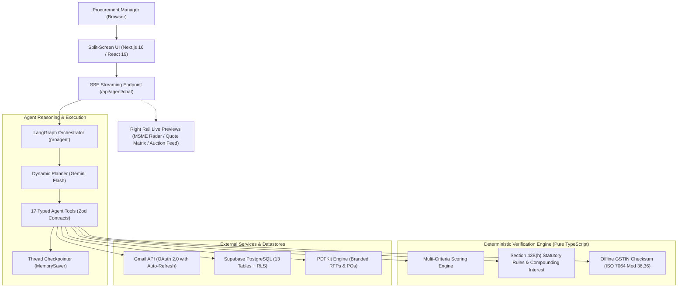

# Procurix - AI-Powered Procurement Platform
 


## 📋 Table of Contents

- [Overview](#overview)
- [Architecture](#architecture)
- [Tech Stack](#tech-stack)
- [The Deterministic Trust Boundary](#the-deterministic-trust-boundary)
- [Database Schema (13 Tables)](#database-schema)
- [Agent System & LangGraph Architecture](#agent-system)
- [Agent Tools (17 Tools across 9 Modules)](#tools)
- [Frontend Components & Split-Screen UX](#frontend-components)
- [API Endpoints](#api-endpoints)
- [Authentication & Authorization](#authentication--authorization)
- [Payment Integration](#payment-integration)
- [Compliance Watch & Daily Cron](#compliance-watch--daily-cron)
- [Environment Variables](#environment-variables)
- [Development Guide](#development-guide)

---

## Overview

**Procurix** is an autonomous, agentic procurement platform engineered specifically for **Indian SMEs and mid-market enterprises** (₹5 Cr – ₹500 Cr turnover). It automates the entire procurement lifecycle from a single natural language chat interface: **requirements intake, RFP generation and Gmail dispatch, multimodal quotation ingestion (PDFs and physical scans), deterministic multi-criteria quote ranking, live tokenized reverse auctions, AI-assisted supplier negotiations, purchase order generation, and statutory Section 43B(h) MSME payment compliance monitoring**.

### Key Capabilities

1. **Autonomous Procurement Loop**: One prompt (*"Buy 250 desks from Kumar, Rapid and Godrej"*) triggers vendor resolution, RFP drafting, auto-numbering (`RFP-0001`), and Gmail dispatch.
2. **Multimodal Quote Ingestion**: Reads vendor replies directly from inboxes, extracting structured line items from PDFs, photographed paper letterheads, and email bodies using Gemini Vision at temperature 0 with strict schema contracts.
3. **Deterministic Multi-Criteria Ranking**: Pure TypeScript scoring engine normalizes and ranks bids against user-configurable weights (Price, Lead Time, Warranty, Payment Terms, Vendor Track Record).
4. **Live Tokenized Reverse Auctions**: Real-time downward bidding room where invited suppliers compete via frictionless tokenized links (no supplier account or portal login required).
5. **Human-in-the-Loop Strategic Negotiations**: Drafts data-driven counter-offers leveraging competitor bids while masking competing supplier identities, requiring buyer approval before dispatch.
6. **Statutory Section 43B(h) MSME Compliance Engine**: Watches India's 45-day statutory payment clock, tracks the 15-day objection grace period, validates offline GSTIN check digits via ISO 7064 Mod 36,36, and calculates compounding interest (3× RBI bank rate) and corporate tax liabilities at risk.
7. **The Trust Boundary (Zero Rupee Hallucinations)**: LLMs handle perception, language, and tool orchestration; pure mathematical code computes rupees, tax exposure, and scoring equations.
8. **Executive Spending & Audit Reports**: Generates board-ready audit reports with embedded Chart.js visualizations.

---

## Architecture

### System Flow



### Directory Structure

```
procurix/
├── agent/                          # AI Agent & Tools (LangGraph + Gemini)
│   ├── agent.tsx                   # LangGraph state machine, system prompt & middleware
│   └── tools/                      # 17 Agent tools across 9 specialized modules
│       ├── rfptool.tsx            # RFP PDF generation & atomic numbering (RFP-XXXX)
│       ├── emailtool.tsx          # Gmail API integration (MIME multipart, OAuth refresh)
│       ├── auctiontool.tsx        # Reverse auction scheduling, monitoring & live feeds
│       ├── vendortool.tsx         # Vendor CRUD, bulk parsing & MSME declaration requests
│       ├── quotetool.tsx          # Quotation synchronization, parsing & status queries
│       ├── compliancetool.tsx     # Section 43B(h) audit, invoice logging & PO dispatch
│       ├── negotiatetool.tsx      # Strategic counter-offer drafting & thread tracking
│       ├── profiletool.tsx        # Company profile master (GSTIN, legal entity, address)
│       └── reporttool.tsx         # Executive report generator with Chart.js charts
│
├── database/                       # 17 Sequential Supabase SQL Schemas (13 Tables + RLS)
│   ├── userprofile-setup.sql      # User authentication & profiles
│   ├── customers-setup.sql        # Subscription plans & credit tracking
│   ├── auctions-setup.sql         # Auctions, bids, vendors & invitations
│   ├── integrations-setup.sql     # OAuth tokens (Gmail & external services)
│   ├── rfp-counter-setup.sql      # Atomic RFP counter (get_next_rfp_number())
│   ├── phase0-foundation.sql      # RFPs and Quotes core tables
│   ├── phase2-purchase-orders.sql # Purchase Orders & line items
│   ├── phase4-negotiations.sql    # Negotiation threads & message history
│   ├── phase5-company-profile.sql # Company legal metadata & GSTIN
│   ├── phase6-tax-clock.sql       # Delivery dates, deemed acceptance, part payments
│   ├── phase7-msme-master.sql     # Udyam categories, activities & audit trails
│   ├── phase9-objection.sql       # Statutory 15-day defect objection clock pause
│   └── phase8-rls.sql             # Row-Level Security policies locking all tables
│
├── src/
│   ├── components/                # React UI Components
│   │   ├── SplitScreenLayout.tsx  # Dual-pane reactive UI
│   │   ├── ChatComposer.tsx       # Natural language input with file upload
│   │   ├── ApprovalCard.tsx       # Human-in-the-loop approval gate cards
│   │   ├── MsmeRadar.tsx          # Section 43B(h) statutory exposure radar
│   │   ├── QuoteComparison.tsx    # Live quote matrix with interactive weight sliders
│   │   └── LiveAuctionFeed.tsx    # Real-time WebSocket/SSE reverse auction feed
│   │
│   ├── lib/                       # Deterministic Pure-Function Engines
│   │   ├── quoteScoring.ts        # Normalized multi-criteria scoring algorithm
│   │   ├── msmeCompliance.ts      # Section 43B(h) interest & deadline calculator
│   │   ├── gstVerify.ts           # Offline ISO 7064 Mod 36,36 GSTIN validator
│   │   ├── quoteParser.ts         # Multimodal quote schema parser
│   │   ├── quoteSync.ts           # Inbox scanner & quote ingestion pipeline
│   │   ├── poGenerator.ts         # Branded Purchase Order PDF generator
│   │   ├── gmailService.ts        # Gmail API wrapper with automatic token refresh
│   │   └── supabase.ts            # Supabase client singleton
│   │
│   └── pages/                     # Next.js Application Pages & API Routes
│       ├── dashboard.tsx          # Unified command center (chat + split preview)
│       ├── compliance.tsx         # Comprehensive MSME tax compliance dashboard
│       ├── suppliers.tsx          # Vendor master management & Udyam audit
│       ├── auction/               # Real-time auction client & vendor bid screens
│       └── api/                   # 28 REST & SSE endpoints
│           ├── agent/chat.ts      # Server-Sent Events agent stream
│           ├── quotes/            # Quote ingestion, sync, and award endpoints
│           ├── cron/              # Daily compliance-watch alert cron
│           └── webhooks/          # Payment webhooks (Lemon Squeezy)
```

---

## Tech Stack

### Frontend
- **Framework**: Next.js 15 (React 19)
- **Styling**: Tailwind CSS + Framer Motion
- **State Management**: React hooks
- **UI Components**: Radix UI primitives
- **Notifications**: Sonner (toast)
- **Charts**: Chart.js

### Backend
- **Runtime**: Node.js (Next.js API routes)
- **Agent Framework**: LangChain + LangGraph
- **AI Models**: Google Gemini Flash / OpenAI GPT-4
- **Database**: Supabase (PostgreSQL)
- **Email**: Gmail API via OAuth
- **Payments**: Lemon Squeezy

### DevOps
- **Hosting**: Vercel (primary) / Cloudflare Workers
- **File Storage**: Temporary `/tmp` (serverless)
- **Real-time**: Server-Sent Events (SSE)

---

## The Deterministic Trust Boundary

A core principle in Procurix's architecture is the **strict separation between probabilistic reasoning and deterministic calculation**:

> **"The model never computes a rupee."**  
> AI models (LLMs) are used exclusively for natural language comprehension, intent planning, tool selection, and multimodal OCR extraction. All scoring algorithms, statutory payment clocks, GSTIN validations, and compounding tax interest calculations run through pure, deterministic TypeScript functions. A figure displayed on screen cannot be hallucinated.

```
┌────────────────────────────────────────────────────────┐
│                   Probabilistic Layer                  │
│   (LangGraph + Gemini Vision: Reasoning, OCR, Intent)  │
└───────────────────────────┬────────────────────────────┘
                            │ Structured Arguments (Zod)
                            ▼
┌────────────────────────────────────────────────────────┐
│               The Deterministic Trust Boundary         │
│   (Pure TypeScript Functions - Zero Hallucinations)    │
│                                                        │
│  1. Quote Scoring Engine (Normalized Multi-Criteria)   │
│  2. Section 43B(h) Statutory Tax Clock & Interest      │
│  3. ISO 7064 Mod 36,36 Offline GSTIN Validator         │
└───────────────────────────┬────────────────────────────┘
                            │ Verified Rupee / Date Figures
                            ▼
┌────────────────────────────────────────────────────────┐
│                 Persistent Ledger & UI                 │
│      (Supabase PostgreSQL 13 Tables + React 19)        │
└────────────────────────────────────────────────────────┘
```

### 1. Multi-Criteria Normalized Scoring (`src/lib/quoteScoring.ts`)

Instead of asking an LLM "which quote is best?", Procurix runs an analytical multi-criteria decision algorithm:

* **Price Normalization (Lower is Better)**:
  $$\text{Score}_{\text{price}} = \frac{\text{Price}_{\max} - \text{Price}}{\text{Price}_{\max} - \text{Price}_{\min}}$$
* **Delivery Normalization (Lower is Better)**:
  $$\text{Score}_{\text{delivery}} = \frac{\text{Days}_{\max} - \text{Days}}{\text{Days}_{\max} - \text{Days}_{\min}}$$
* **Quality & Reliability Score**:
  $$\text{Score}_{\text{quality}} = \text{base}(0.5) + \text{WinRate} + \text{WarrantyBonus}(0.15) + \text{TermsBonus}(0.10) - \text{UncertaintyPenalty}(0.25)$$
* **Weighted Aggregate Rank**:
  $$\text{Total Score} = \frac{W_p \cdot \text{Score}_{\text{price}} + W_d \cdot \text{Score}_{\text{delivery}} + W_q \cdot \text{Score}_{\text{quality}}}{W_p + W_d + W_q}$$

*Default weights:* Price: 50%, Delivery: 30%, Quality: 20%. When a user adjusts sliders on the frontend, the ranking updates instantly and deterministically without invoking the LLM.

---

### 2. Statutory Section 43B(h) Compliance Engine (`src/lib/msmeCompliance.ts`)

Under Section 43B(h) of the Indian Income Tax Act (in effect from FY 2023–24) and Section 15 of the MSMED Act 2006, payment deadlines are strictly bounded:

* **Statutory Maximum Term**: Maximum 45 calendar days under written agreement. Any contractual clause specifying >45 days (e.g., "Net 60" or "Net 90") is void in law; the clock enforces the 45-day cap.
* **Default Term (No Written Agreement)**: Automatically capped at **15 calendar days** from delivery.
* **Objection Grace Period**: If an objection regarding product defects is formally lodged within 15 days of delivery, the clock is frozen until the objection is marked resolved.
* **Scope Exclusion**:
  * **Medium Enterprises**: Exempt (only Micro & Small are covered).
  * **Traders / Retailers / Wholesalers**: Exempt from 43B(h) delayed-payment provisions per Office Memorandum 1/4(1)/2021-P&G Policy (September 1, 2021).
* **Compounding Interest Penalty (Section 16, MSMED Act)**:
  Interest is computed at **3× the RBI bank rate** (default $6.5\% \times 3 = 19.5\%$ p.a.), **compounded monthly**:
  $$\text{Interest} = \text{Principal} \times \left( \left(1 + \frac{r_{\text{annual}}}{12}\right)^{n_{\text{months}}} - 1 \right)$$
* **Tax Loss at Risk**:
  $$\text{Tax Deduction Deferred} = \text{Overdue Amount} \times 25\% \text{ (Corporate Tax Rate)}$$

---

### 3. ISO 7064 Mod 36,36 Offline GSTIN Validator (`src/lib/gstVerify.ts`)

To verify Indian suppliers without paying for or awaiting government GST portal API roundtrips, Procurix implements the complete **ISO 7064 Mod 36,36 check-digit verification**:

* **Structure**: `2 State Digits` + `10 Alphanumeric PAN` + `1 Entity Number` + `Z` + `1 Check Character`.
* **Algorithm**:
  1. Characters mapped to Base36 values ($0-9 \to 0-9, A-Z \to 10-35$).
  2. Alternating weight factor ($1, 2, 1, 2...$).
  3. Modulo 36 checksum compared against the 15th character.
* **Instant Offline Metadata Extraction**:
  - Automatically identifies state from state code (`07` $\to$ Delhi, `27` $\to$ Maharashtra, etc.).
  - Extracts entity classification directly from the 4th PAN character (`C` $\to$ Company, `P` $\to$ Individual, `F` $\to$ Partnership, etc.).
* Catches invented or typo-ridden GST numbers instantly before any PO or RFP is created.

---

## Database Schema (13 Relational Tables)

#### 1. **userprofile**
Stores authenticated user information from Google OAuth.

| Column | Type | Description |
|--------|------|-------------|
| `id` | UUID | Primary key |
| `google_id` | TEXT | Unique Google OAuth ID |
| `email` | TEXT | User email (unique) |
| `name` | TEXT | Full name |
| `picture` | TEXT | Profile picture URL |
| `email_verified` | BOOLEAN | Email verification status |
| `role` | TEXT | User role (from onboarding) |
| `industry` | TEXT | User industry |
| `created_at` | TIMESTAMPTZ | Account creation date |
| `updated_at` | TIMESTAMPTZ | Last update |
| `last_login` | TIMESTAMPTZ | Last login timestamp |

**Indexes**: `google_id`, `email`, `created_at`

---

#### 2. **customers**
Manages subscription plans and credit system.

| Column | Type | Description |
|--------|------|-------------|
| `id` | UUID | Primary key |
| `email` | TEXT | User email (unique) |
| `customer_id` | TEXT | Lemon Squeezy customer ID |
| `order_id` | TEXT | Order reference |
| `variant_id` | TEXT | Product variant ID |
| `plan_name` | TEXT | `free`, `topup`, `plus` |
| `subscription_status` | TEXT | `active`, `cancelled`, `expired` |
| `monthly_chat_credit` | INT | Base monthly credits |
| `plan_chat_credit` | INT | Bonus credits (-1 = unlimited) |
| `total_chat_credit` | INT | Computed total |
| `monthly_doc_credit` | INT | Document generation credits |
| `plan_doc_credit` | INT | Bonus doc credits |
| `total_doc_credit` | INT | Computed total |
| `amount_paid` | DECIMAL | Payment amount |
| `renews_at` | TIMESTAMPTZ | Renewal date |

**Credit Logic**:
- `free`: 50 chat, 10 doc
- `topup`: +200 chat, +50 doc
- `plus`: Unlimited (-1)

**Indexes**: `email`, `customer_id`, `plan_name`, `subscription_status`

---

#### 3. **auctions**
Main auction table for procurement events.

| Column | Type | Description |
|--------|------|-------------|
| `id` | UUID | Primary key |
| `auction_number` | TEXT | `AUC-0001` format (unique) |
| `title` | TEXT | Auction title |
| `description` | TEXT | Detailed description |
| `rfp_id` | TEXT | Associated RFP number |
| `scheduled_start` | TIMESTAMPTZ | Scheduled start time |
| `scheduled_end` | TIMESTAMPTZ | Scheduled end time |
| `actual_start` | TIMESTAMPTZ | Actual start |
| `actual_end` | TIMESTAMPTZ | Actual end |
| `duration_hours` | INT | Duration (default 24) |
| `auction_type` | TEXT | `manual_decrement`, `percentage_decrement`, `amount_decrement` |
| `decrement_value` | NUMERIC | Decrement amount/percentage |
| `base_price` | NUMERIC | Starting price |
| `current_price` | NUMERIC | Current lowest bid |
| `winning_bid` | NUMERIC | Final winning bid |
| `status` | TEXT | `scheduled`, `active`, `completed`, `cancelled` |
| `winner_vendor_id` | UUID | Winning vendor |
| `winner_vendor_email` | TEXT | Winner email |
| `winner_vendor_name` | TEXT | Winner name |
| `invited_vendors` | JSONB | Array of invited vendors |
| `total_bids` | INT | Total bids received |
| `created_by` | TEXT | User who created |

**Auction Types**:
- **manual_decrement**: Any amount below current price
- **percentage_decrement**: Must be X% lower
- **amount_decrement**: Fixed ₹X lower

---

#### 4. **bids**
Individual bid records for auctions.

| Column | Type | Description |
|--------|------|-------------|
| `id` | UUID | Primary key |
| `auction_id` | UUID | FK to auctions |
| `vendor_id` | UUID | Vendor identifier |
| `vendor_email` | TEXT | Bidder email |
| `vendor_name` | TEXT | Bidder name |
| `amount` | NUMERIC | Bid amount |
| `previous_price` | NUMERIC | Price before this bid |
| `bid_number` | INT | Sequential bid number |
| `is_valid` | BOOLEAN | Validation status |
| `rejection_reason` | TEXT | Why rejected (if invalid) |
| `created_at` | TIMESTAMPTZ | Bid timestamp |

**Unique Constraint**: `(auction_id, bid_number)`

---

#### 5. **vendors**
Vendor/supplier database.

| Column | Type | Description |
|--------|------|-------------|
| `id` | UUID | Primary key |
| `name` | TEXT | Vendor name |
| `email` | TEXT | Contact email (unique) |
| `website` | TEXT | Company website |
| `address` | TEXT | Physical address |
| `phone` | TEXT | Contact phone |
| `total_auctions_participated` | INT | Auction count |
| `total_wins` | INT | Won auctions |

---

#### 6. **auction_invitations**
Tracks email invitations sent to vendors.

| Column | Type | Description |
|--------|------|-------------|
| `id` | UUID | Primary key |
| `auction_id` | UUID | FK to auctions |
| `vendor_id` | UUID | Vendor reference |
| `vendor_email` | TEXT | Recipient email |
| `vendor_name` | TEXT | Recipient name |
| `invitation_status` | TEXT | `sent`, `failed`, `bounced` |
| `invitation_sent_at` | TIMESTAMPTZ | Send timestamp |

---

#### 7. **user_integrations**
OAuth tokens for third-party integrations.

| Column | Type | Description |
|--------|------|-------------|
| `id` | UUID | Primary key |
| `user_id` | TEXT | User identifier |
| `integration_type` | TEXT | `gmail`, `slack`, etc. |
| `access_token` | TEXT | OAuth access token |
| `refresh_token` | TEXT | OAuth refresh token |
| `token_expiry` | TIMESTAMPTZ | Token expiration |
| `is_active` | BOOLEAN | Active status |
| `connected_at` | TIMESTAMPTZ | Connection timestamp |
| `metadata` | JSONB | Additional data |

**Unique Constraint**: `(user_id, integration_type)`

---

#### 8. **rfp_counter**
Sequential RFP number generation (serverless-safe).

| Column | Type | Description |
|--------|------|-------------|
| `id` | INT | Always 1 (single row) |
| `last_number` | INT | Last RFP number issued |
| `updated_at` | TIMESTAMPTZ | Last update |

**Function**: `get_next_rfp_number()` - Atomically increments and returns the next sequential number (e.g., `1` $\to$ `RFP-0001`).

---

#### 9. **rfps**
Master RFP requirements and issued documents.

| Column | Type | Description |
|--------|------|-------------|
| `id` | UUID | Primary key |
| `rfp_number` | TEXT | Unique number (`RFP-0001`) |
| `title` | TEXT | Requirement title |
| `customer_email` | TEXT | Buyer account email |
| `company_name` | TEXT | Issuing buyer company name |
| `contact_name` | TEXT | Procurement officer name |
| `contact_email` | TEXT | Buyer contact email |
| `metadata` | JSONB | Scope, quantities, specs, terms |
| `pdf_path` | TEXT | Path to generated RFP PDF |
| `status` | TEXT | `draft`, `sent`, `quoting`, `awarded`, `closed` |
| `sent_to` | TEXT[] | Array of vendor recipient emails |
| `sent_at` | TIMESTAMPTZ | Time sent to suppliers |
| `created_at` | TIMESTAMPTZ | Creation timestamp |

**Indexes**: `customer_email`, `rfp_number`, `status`

---

#### 10. **quotes**
Multimodal quotes parsed from supplier emails, PDFs, and photographed paper letterheads.

| Column | Type | Description |
|--------|------|-------------|
| `id` | UUID | Primary key |
| `rfp_id` | UUID | FK to `rfps` |
| `rfp_number` | TEXT | RFP reference |
| `customer_email` | TEXT | Buyer account email |
| `vendor_email` | TEXT | Supplier email address |
| `vendor_name` | TEXT | Supplier company name |
| `total_amount` | NUMERIC | Extracted quote total in INR |
| `currency` | TEXT | Currency (default `INR`) |
| `delivery_days` | INT | Promised delivery lead time in days |
| `payment_terms` | TEXT | Quoted commercial terms (e.g., "Net 30", "50% advance") |
| `warranty` | TEXT | Warranty period quoted |
| `line_items` | JSONB | Extracted line item breakdown |
| `confidence` | NUMERIC | Extraction confidence score ($0.0 - 1.0$) |
| `source` | TEXT | `email`, `upload`, `manual` |
| `raw_email_id` | TEXT | Gmail message ID |
| `status` | TEXT | `received`, `shortlisted`, `rejected`, `awarded` |
| `revision_of` | UUID | Self-referencing FK tracking negotiated quote versions |
| `received_at` | TIMESTAMPTZ | Ingestion timestamp |

**Indexes**: `rfp_id`, `customer_email`, `vendor_email`  
**Unique Constraint**: `(rfp_id, vendor_email, raw_email_id)`

---

#### 11. **purchase_orders**
Binding legal purchase orders issued to winning vendors, tracking the Section 43B(h) clock.

| Column | Type | Description |
|--------|------|-------------|
| `id` | UUID | Primary key |
| `po_number` | TEXT | Unique number (`PO-9001`) |
| `rfp_id` | UUID | FK to `rfps` |
| `quote_id` | UUID | FK to winning `quotes` record |
| `customer_email` | TEXT | Buyer email |
| `buyer_company` | TEXT | Buyer legal business entity |
| `vendor_email` | TEXT | Supplier recipient email |
| `vendor_name` | TEXT | Supplier business name |
| `vendor_is_msme` | BOOLEAN | MSME status snapshot at award time |
| `vendor_msme_category` | TEXT | `micro`, `small`, `medium`, `not_registered` |
| `vendor_udyam_activity` | TEXT | `manufacturing`, `service`, `trading` |
| `total_amount` | NUMERIC | Total order amount in INR |
| `payment_terms` | TEXT | Contractual terms agreed |
| `delivered_at` | TIMESTAMPTZ | Delivery date |
| `goods_accepted_at` | TIMESTAMPTZ | Date goods accepted (deemed or explicit) |
| `objection_raised_at` | TIMESTAMPTZ | Formal 15-day defect objection date (pauses clock) |
| `objection_resolved_at` | TIMESTAMPTZ | Date defect objection resolved (resets clock) |
| `invoice_received_at` | TIMESTAMPTZ | Date supplier invoice logged |
| `amount_paid` | NUMERIC | Cumulative rupees paid (tracks part payments) |
| `paid_at` | TIMESTAMPTZ | Final settlement timestamp |
| `status` | TEXT | `issued`, `sent`, `invoiced`, `paid`, `cancelled` |

---

#### 12. **compliance_events**
Immutable statutory audit ledger documenting every compliance milestone.

| Column | Type | Description |
|--------|------|-------------|
| `id` | UUID | Primary key |
| `po_id` | UUID | FK to `purchase_orders` |
| `po_number` | TEXT | PO reference number |
| `customer_email` | TEXT | Buyer account email |
| `event` | TEXT | `delivered`, `accepted`, `objected`, `invoiced`, `part_paid`, `paid`, `notified`, `declaration_requested` |
| `occurred_at` | TIMESTAMPTZ | Exact event timestamp |
| `note` | TEXT | Contextual reason and statutory basis |
| `amount` | NUMERIC | Financial value associated with event |

---

#### 13. **negotiations**
Counter-offer drafts, negotiation threads, and savings tracking.

| Column | Type | Description |
|--------|------|-------------|
| `id` | UUID | Primary key |
| `rfp_id` | UUID | FK to `rfps` |
| `quote_id` | UUID | FK to target `quotes` record |
| `vendor_email` | TEXT | Target vendor email |
| `current_amount` | NUMERIC | Original quoted price |
| `target_amount` | NUMERIC | Proposed counter-offer target price |
| `leverage` | TEXT | Market rationale & negotiation angle |
| `subject` | TEXT | Generated email subject line |
| `body` | TEXT | Professional counter-offer draft (HTML) |
| `status` | TEXT | `draft`, `sent`, `replied`, `declined`, `cancelled` |
| `result_amount` | NUMERIC | Final negotiated price accepted |

---

#### 14. **Row-Level Security (RLS) Architecture**

Every table is protected via Supabase PostgreSQL Row-Level Security (`phase8-rls.sql` & `phase11-rls-procurement.sql`):
- **Tenant Isolation**: Queries strictly enforce `customer_email = auth.email()` or `customer_id` mapping.
- **Service Role Bypass**: Backend API routes running administrative actions authenticate via `SUPABASE_SERVICE_ROLE_KEY` with strict server-side validation.
- **Vendor Token Access**: Suppliers access reverse auctions via one-way cryptographically secure random tokens without possessing database user credentials.

---

## Agent System

### Agent Architecture (LangGraph State Machine)

The agent is built using **LangGraph** over **Google Gemini** (`gemini-3.5-flash-lite`), providing a stateful, cyclical reasoning loop with typed tool execution.

**Location**: [`agent/agent.tsx`](file:///n:/Dev/Portfolio%20Apps/AI%20Agent/agent/agent.tsx)

### Agent Configuration

```typescript
const model = new ChatGoogleGenerativeAI({
  model: "gemini-3.5-flash-lite",
  temperature: 0.3, // Low temperature for deterministic tool calling
  topP: 0.95,
  topK: 40,
  maxRetries: 3    // Auto-retries transient 503s with exponential backoff
});

const proagent = createAgent({
  model,
  middleware: [dynamicSystemPromptMiddleware(() => SYSTEM_PROMPT + todayBlock())],
  tools: [
    emailTool, 
    rfpTool, 
    scheduleAuctionTool, 
    viewAuctionsTool, 
    checkLiveAuctionTool,
    addVendorTool, 
    addVendorsBulkTool, 
    listVendorsTool, 
    deleteVendorTool, 
    requestMsmeDeclarationTool,
    generateExecutiveReportTool,
    checkQuotesTool,
    checkMsmeComplianceTool, 
    recordInvoiceTool, 
    sendPurchaseOrderTool,
    draftNegotiationTool, 
    listNegotiationsTool,
    setCompanyProfileTool, 
    getCompanyProfileTool
  ],
  checkpointer: new MemorySaver(), // Thread-based session persistence
  systemPrompt: SYSTEM_PROMPT,
});
```

### Key Behavioral Principles

1. **Dynamic Real-Time Calendar Clock Injection (`todayBlock()`)**:
   LLMs have no internal clock. Every agent invocation dynamically injects the exact real-time calendar date in Indian Standard Time (`Asia/Kolkata`):
   ```
   Today is Sunday, 4 October 2026. In YYYY-MM-DD form that is 2026-10-04. Timezone: Asia/Kolkata.
   ```
   Relative expressions (*"yesterday"*, *"two days after delivery"*, *"next Thursday"*) are resolved to calendar dates deterministically before passing to tools.

2. **Three Human-in-the-Loop Approval Gates**:
   - **Gate 1 (RFP Dispatch)**: RFP is drafted, numbered, rendered as a PDF, and shown on screen. Sent only upon explicit user confirmation.
   - **Gate 2 (Negotiation)**: Counter-offers are drafted with competitor names masked and saved as drafts. Never sent without buyer approval.
   - **Gate 3 (Financial Commitment / PO)**: Quotations are scored and recommended; the human procurement manager clicks "Award" to issue a legal Purchase Order.

3. **One Confirmation Rule**:
   The agent avoids conversational ping-pong. Missing non-critical parameters are inferred with standard defaults and presented in a single structured confirmation block.

4. **Zero Rupee Hallucination Policy**:
   The agent never invents supplier quotes, discounts, or deadlines. If a quote field is unreadable, it returns `null` with a low confidence score, flagging it for human verification.

### Agent Invocation Flow

```typescript
// API Route: /api/agent/chat.ts
const stream = await proagent.stream(
  { messages: messages },
  { 
    configurable: { 
      thread_id: threadId,           // Conversation persistence
      userId: userId,                 // User context for tools
      customerEmail: user.email,      // Tenant scoping
      chatSessions: chatSessions      // Historical context
    },
    streamMode: 'values'              // Stream full state updates
  }
);
```

### Streaming Protocol (SSE)

The agent streams responses using Server-Sent Events:

**Event Types**:
- `connected` - Initial connection
- `tool_call_start` - Tool invocation begins
- `tool_call_end` - Tool completes with result
- `content` - Assistant text response (streamed)
- `done` - Stream complete
- `error` - Error occurred

**Frontend Handling** (`dashboard.tsx`):
```typescript
const reader = response.body?.getReader();
while (true) {
  const { done, value } = await reader.read();
  const chunk = decoder.decode(value);
  const events = chunk.split('\n\n');
  
  for (const event of events) {
    if (event.startsWith('data: ')) {
      const data = JSON.parse(event.slice(6));
      
      if (data.type === 'tool_call_start') {
        // Show progress indicator
      } else if (data.type === 'content') {
        // Typewriter effect
      }
    }
  }
}
```

---

## Tools

Tools are the agent's capabilities to interact with external systems. Each tool has a **name**, **description**, **schema** (Zod), and **execution function**.

### 1. **RFP Tool** (`rfptool.tsx`)

**Purpose**: Generate professional RFP PDFs with premium amber theme.

**Schema**:
```typescript
{
  rfp_title: string,
  project_overview: string,
  scope_of_work: string,
  technical_requirements: string,
  delivery_requirements: string,
  commercial_requirements: string,
  vendor_qualifications: string,
  evaluation_criteria: string,
  submission_instructions: string,
  contact_name: string,
  contact_email: string,
  company_name: string,
  contact_phone?: string,
  contact_title?: string
}
```

**Process**:
1. Get next RFP number from `rfp_counter` table (atomic)
2. Generate PDF using **PDFKit** with:
   - Cover page with company branding
   - Executive summary
   - Detailed requirements sections
   - Contact information cards
   - Professional typography (Helvetica)
3. Save to `/tmp/rfps/RFP-XXXX.pdf`
4. Return file path for email attachment

**PDF Structure**:
- Page 1: Cover (gradient header, RFP number, title)
- Page 2-4: Content sections with rounded cards
- Page 5: Contact details and submission instructions
- All pages: Headers, footers, page numbers

**File Storage**: Cross-platform temporary directory (`/tmp` on Linux/Vercel, OS temp on Windows)

---

### 2. **Email Tool** (`emailtool.tsx`)

**Purpose**: Send emails via Gmail API (OAuth-authenticated).

**Schema**:
```typescript
{
  to: string,              // Recipient email
  subject: string,         // Email subject
  message: string,         // HTML body
  attachment_path?: string, // Optional file path
  is_html?: boolean,       // Default true
  user_id?: string         // For OAuth token lookup
}
```

**Process**:
1. Retrieve user's Gmail tokens from `user_integrations` table
2. Check token expiry, refresh if needed
3. Read attachment file if provided (handles both `/tmp` and project paths)
4. Create RFC 2822 formatted message with MIME multipart
5. Base64url encode and send via Gmail API
6. Return success/failure status

**Key Features**:
- **Token Refresh**: Automatically refreshes expired access tokens
- **Attachments**: Supports PDF/document attachments with base64 encoding
- **HTML Formatting**: Professional email templates with CSS
- **Error Handling**: Clear error messages for connection issues

**Gmail Integration Flow**:
```
User → Settings → Connect Gmail
  → OAuth consent screen
  → Callback saves tokens to user_integrations
  → Tokens used in emailTool
```

---

### 3. **Auction Tool** (`auctiontool.tsx`)

Three separate tools for auction management:

#### A. **scheduleAuctionTool**

**Purpose**: Create and schedule a procurement auction.

**Schema**:
```typescript
{
  title: string,
  description: string,
  auction_date: string,              // Parsed to TIMESTAMPTZ
  auction_time?: string,             // Optional time
  auction_type: "manual_decrement" | "percentage_decrement" | "amount_decrement",
  base_price: number,
  vendor_selection: "all" | "custom",
  vendor_ids?: string[],             // Existing vendors
  custom_vendor_names?: string[],   // New vendors
  custom_vendor_emails?: string[],
  decrement_value?: number,         // For percentage/amount types
  duration_hours?: number,          // Default 24
  company_name?: string,            // For email branding
  contact_person?: string,
  auction_date_formatted?: string,  // Display format
  auction_time_formatted?: string
}
```

**Process**:
1. Generate auction number (`AUC-0001` format)
2. Parse date/time (handles "today", "now", fuzzy dates)
3. Calculate `scheduled_start` and `scheduled_end`
4. Validate vendors (fetch existing or add new)
5. Insert auction record with `status: 'scheduled'`
6. Send invitation emails to all vendors with:
   - Premium HTML template (amber theme)
   - Auction details table
   - Bidding rules
   - CTA button linking to vendor dashboard
7. Record invitations in `auction_invitations` table
8. Return confirmation with auction URL

**Invitation Email Features**:
- Responsive design
- Company branding (uses provided company_name)
- Formatted date/time display
- Auction type explanation
- Rules section with visual bullets

#### B. **viewAuctionsTool**

**Purpose**: List all auctions with filtering.

**Schema**:
```typescript
{
  status?: "scheduled" | "active" | "completed" | "cancelled",
  limit?: number  // Default 10
}
```

**Returns**:
- Auction list with details
- Current bid status
- Vendor participation
- Time remaining

#### C. **checkLiveAuctionTool**

**Purpose**: Get real-time auction status.

**Schema**:
```typescript
{
  auction_id: string
}
```

**Returns**:
- Current price
- Total bids
- Latest bids (last 5)
- Vendor leaderboard
- Time remaining

---

### 4. **Vendor Tool** (`vendortool.tsx`)

Four tools for vendor database management:

#### A. **addVendorTool**

**Schema**:
```typescript
{
  name: string,
  email: string,      // Validated and unique
  website?: string,
  address?: string,
  phone?: string
}
```

**Process**:
- Validates email format
- Checks for duplicates
- Inserts into `vendors` table

#### B. **addVendorsBulkTool**

**Schema**:
```typescript
{
  vendors_data: string  // JSON array or CSV-like text
}
```

**Parsing Logic**:
- Tries JSON.parse first
- Falls back to regex pattern matching:
  - "Name - email@example.com"
  - "email@example.com: Name"
- Validates each email
- Skips duplicates

**Returns**:
```typescript
{
  total: number,
  added: number,
  skipped: number,
  failed: number,
  details: Array<{ name, email, status, reason }>
}
```

#### C. **listVendorsTool**

**Schema**: Empty (lists all vendors)

**Returns**: Array of all vendors with stats

#### D. **deleteVendorTool**

**Schema**:
```typescript
{
  email: string  // Identifies vendor to delete
}
```

#### E. **requestMsmeDeclarationTool**

**Purpose**: Dispatches an official statutory declaration request email to an Indian supplier asking for their Udyam registration certificate, MSME category, and GSTIN.

**Schema**:
```typescript
{
  vendor_email: string,
  company_name?: string
}
```

---

### 5. **Quotation Ingestion & Vision Sync Tool** (`quotetool.tsx` & `src/lib/quoteSync.ts`)

#### **checkQuotesTool**

**Purpose**: Scans connected Gmail inboxes, extracts quotes from attachments (PDFs and JPEG/PNG physical paper scans) using Gemini Vision, parses commercial terms, tracks revisions, and presents sorted quotes.

**Schema**:
```typescript
{
  rfp_number?: string, // e.g., 'RFP-0001' (Optional: filters by specific requirement)
  sync?: boolean       // Default: true (triggers live inbox scan before querying DB)
}
```

**Multimodal Extraction Pipeline (`src/lib/quoteSync.ts`)**:
1. Queries Gmail API for messages matching `subject:(RFP-XXXX)` received by the user.
2. Extracts email body and all binary attachments (PDF, PNG, JPG, WEBP).
3. Passes content to **Gemini Vision** with strict zero-temperature parameters and Zod schema:
   - Line items: name, quantity, unit price, total price
   - Total commercial amount (INR)
   - Delivery lead time in days
   - Stated payment terms (e.g., "Net 30", "100% advance")
   - Stated warranty duration
   - Parse confidence score ($0.0 - 1.0$)
4. **Fallback & Confidence Principle**: If a figure or date is illegible in a photographed letterhead, the parser outputs `null` with a confidence score $< 0.5$, marking it on screen as requiring human inspection rather than hallucinating plausible figures.
5. **Negotiation Revision Tracking**: If the quote is a revised offer from an existing vendor, automatically links it to the original via `revision_of` and computes the exact rupee savings achieved.

---

### 6. **Section 43B(h) Statutory Compliance & Orders Suite** (`compliancetool.tsx`)

Three interconnected tools powering India's tax-loss prevention engine:

#### A. **checkMsmeComplianceTool**

**Purpose**: Audits all company purchase orders against Section 43B(h) statutory deadlines and calculates real-time rupee exposure.

**Schema**:
```typescript
{
  only_at_risk?: boolean // Default: false (true filters to 'urgent' and 'breached' orders only)
}
```

**Execution**:
- Resolves supplier Udyam categorization (`micro`, `small`, `medium`) and activity (`manufacturing`, `service`, `trading`).
- Applies statutory exclusions (Traders excluded per 2021 OM; Medium enterprises excluded per Section 15 MSMED Act).
- Calculates exact payment deadlines: 45 days (written agreement) or 15 days (default/no written agreement).
- Incorporates the 15-day defect objection grace period: if an objection was raised in writing within 15 days of delivery, the clock is frozen until resolved.
- Computes Section 16 MSMED compounding interest at 3× RBI bank rate (19.5% p.a.) compounded monthly.
- Calculates tax liability at risk ($25\% \times \text{Overdue Principal}$).
- Returns color-coded status: `safe`, `due_soon`, `urgent`, `breached`, `paid`.

#### B. **recordInvoiceTool**

**Purpose**: Logs delivery dates, deemed/explicit acceptance, defect objections, invoice arrival, and part-payments against a Purchase Order.

**Schema**:
```typescript
{
  po_number: string,
  invoice_date?: string,
  delivered_date?: string,
  accepted_date?: string,
  objection_date?: string,
  objection_resolved_date?: string,
  amount_paid?: number,
  mark_paid?: boolean
}
```

**Statutory Event Logging**:
- Writes immutable audit events into `compliance_events` table for legal defensibility during tax audits.
- Deemed acceptance: If goods are delivered and no objection is raised within 15 days, day of delivery is treated as day of deemed acceptance.

#### C. **sendPurchaseOrderTool**

**Purpose**: Generates an official, legally binding Purchase Order PDF with corporate GSTIN and legal letterhead, emails it to the awarded vendor, and initializes the statutory tracking clock.

**Schema**:
```typescript
{
  rfp_number: string,
  vendor_email: string,
  payment_terms?: string,
  notes?: string
}
```

---

### 7. **Strategic Negotiation Engine** (`negotiatetool.tsx`)

#### A. **draftNegotiationTool**

**Purpose**: Drafts strategic, high-leverage counter-offer emails using market spread data while **strictly masking competitor identities**.

**Schema**:
```typescript
{
  rfp_number: string,
  vendor_email?: string,
  target_amount?: number // Target price in INR (if omitted, calculated from best rival bid)
}
```

**Negotiation Drafter Logic (`src/lib/negotiationDrafter.ts`)**:
- Identifies the competitor price spread.
- Computes fair target savings without asking for unrealistic discounts.
- Generates a persuasive, professional HTML counter-offer citing rival market data without disclosing rival company names.
- Saves the draft into `negotiations` table in `draft` status for the buyer to review, edit, or approve.

#### B. **listNegotiationsTool**

**Purpose**: Lists all active and historical negotiation threads, target amounts, and savings achieved upon supplier acceptance.

---

### 8. **Company Profile Master** (`profiletool.tsx`)

#### A. **setCompanyProfileTool**
**Schema**: `{ company_name: string, company_address?: string, company_gstin?: string, contact_name?: string, contact_title?: string, contact_phone?: string }`  
**Purpose**: Saves the buyer's official legal entity name, GSTIN, and letterhead details to `userprofile`.

#### B. **getCompanyProfileTool**
**Schema**: `{}`  
**Purpose**: Retrieves profile data to ensure generated RFPs and POs never use generic placeholder strings.

---

### 9. **Executive Spend & Audit Reporting Tool** (`reporttool.tsx`)

**Purpose**: Generate executive summary PDFs using AI sub-agent.

**Schema**:
```typescript
{
  date?: string  // Default: today
}
```

**Process (Two-Stage AI)**:

#### Stage 1: Report Analyst Sub-Agent
```typescript
const reportSubAgent = new ChatGoogleGenerativeAI({
  model: "gemini-2.5-flash",
  temperature: 0.3
});
```

**Sub-Agent Prompt**: Analyzes chat history and extracts:
- `workCompleted`: Concrete actions (RFP-XXXX, AUC-XXXX, emails sent)
- `keyDecisions`: Important choices made
- `problemsSolved`: Issues resolved
- `insights`: Patterns and learnings
- `actionItems`: Next steps
- `summary`: 2-3 sentence overview

**Input**: Full chat history for specified date
**Output**: JSON object with categorized activities

#### Stage 2: Chart Generation & PDF Creation

**Charts Generated** (using Chart.js):
1. **Activities Pie Chart**: Work distribution (RFPs, Auctions, Emails, Vendors)
2. **Timeline Bar Chart**: Hourly activity distribution

**PDF Structure** (PDFKit):
1. Cover page with company logo, date, executive summary
2. Work completed section (bullet list)
3. Activity pie chart (embedded PNG)
4. Key decisions section
5. Timeline chart
6. Problems solved & insights
7. Action items with checkboxes

**File Output**: `/tmp/reports/Executive_Report_YYYY-MM-DD.pdf`

**Robust Parsing**: Handles AI-generated JSON with nested quotes using custom string extraction (bypasses JSON.parse issues).

---

## Frontend Components

### Dashboard (`src/pages/dashboard.tsx`)

**Main Chat Interface** - 1980 lines of comprehensive chat UI.

**State Management**:
```typescript
// User & Auth
const [user, setUser] = useState<UserSession | null>(null);

// Chat State
const [chatMessages, setChatMessages] = useState<ChatMessage[]>([]);
const [threadId, setThreadId] = useState<string>(`thread-${Date.now()}`);
const [streamingContent, setStreamingContent] = useState<string>("");
const [fullContentBuffer, setFullContentBuffer] = useState<string>("");
const [isTyping, setIsTyping] = useState<boolean>(false);
const [progressSteps, setProgressSteps] = useState<string[]>([]);

// Credits
const [chatCredits, setChatCredits] = useState({ total: 0, isUnlimited: false });
const [documentCredits, setDocumentCredits] = useState({ total: 0, isUnlimited: false });

// UI
const [showUpgradeModal, setShowUpgradeModal] = useState(false);
const [splitScreenActive, setSplitScreenActive] = useState(false);
```

**Key Features**:

1. **Session Management**:
   - Loads user from cookie
   - Checks onboarding status
   - Fetches customer credits

2. **Chat History**:
   - Saved to localStorage
   - Session switching
   - Thread-based persistence

3. **Typewriter Effect**:
   - 20ms interval streaming
   - Smooth character-by-character display
   - Pauses for tool execution

4. **SSE Handling**:
   ```typescript
   const reader = response.body?.getReader();
   const decoder = new TextDecoder();
   
   while (true) {
     const { done, value } = await reader.read();
     const chunk = decoder.decode(value);
     
     // Parse SSE events
     // Handle tool_call_start, content, done
   }
   ```

5. **Tool Result Display**:
   - RFP generation shows download button
   - Auction creation shows split-screen option
   - Email confirmations with details

6. **Credit Management**:
   - Checks before each query
   - Shows upgrade modal if depleted
   - Real-time credit display in sidebar

7. **Dynamic Suggestions**:
   - Context-aware follow-up prompts
   - Based on last tool used
   - Example: After RFP → "Send this RFP to vendors"

---

### ChatComposer (`src/components/ChatComposer.tsx`)

**Smart Input Component** with drag-drop file upload.

**Features**:

1. **Dynamic Placeholder**:
   - Typing animation with multiple texts
   - Stops animation once chat starts
   - Professional procurement prompts

2. **File Attachment**:
   - Drag & drop support
   - Image preview
   - Document icons
   - Validation (size, type)

3. **Gmail Status**:
   - Shows connection indicator
   - Opens integrations modal
   - Real-time status check

4. **Prompt Injection**:
   - Quick action buttons trigger preset prompts
   - Auto-scrolls to composer
   - Pre-fills input for user

5. **Credit Display**:
   - Shows remaining chat/doc credits
   - Visual progress indicators
   - Upgrade prompts

---

### LiveAuctionFeed (`src/components/LiveAuctionFeed.tsx`)

**Real-time Auction Display** - Polls auction status every 5 seconds.

**Features**:
- Current price display
- Bid history table
- Vendor leaderboard
- Time remaining countdown
- Auto-refresh

**Used In**: Split-screen view when auction is active.

---

### SplitScreenLayout (`src/components/SplitScreenLayout.tsx`)

**Dual-Pane Reactive Workspace** - Left pane hosts the agent chat with SSE streaming; right pane dynamically opens contextual previews depending on the active stage:
- **RFP Stage**: Live PDF preview with instant download.
- **Quotation Stage**: Interactive Quote Comparison matrix with real-time weight sliders.
- **Auction Stage**: Real-time reverse auction leaderboard and bid telemetry (`LiveAuctionFeed`).
- **Compliance Stage**: Section 43B(h) MSME Exposure Radar (`MsmeRadar`).
- **Order Stage**: Purchase Order preview and dispatch confirmation.

---

### ApprovalCard (`src/components/ApprovalCard.tsx`)

**Human-in-the-Loop Safeguard Component** - Renders interactive approval blocks directly within the streaming conversation:

1. **RFP Approval**: Reviews generated title, scope, items, and recipient list before dispatches.
2. **Negotiation Approval**: Displays the drafted HTML counter-offer, target amount, and market leverage, allowing one-click dispatch or cancellation.
3. **PO Award Approval**: Summarizes total financial commitment, delivery lead time, and vendor MSME status before committing company funds.

---

### MsmeRadar (`src/components/MsmeRadar.tsx`)

**Statutory Exposure Telemetry Widget**:
- Visual status pills: `safe` (green), `due_soon` (amber, <15 days remaining), `urgent` (orange, <5 days remaining), and `breached` (red, statutory violation).
- Displays exact rupee sums: **Overdue Principal**, **Corporate Tax at Risk (25%)**, and **Accrued Monthly Compounding Interest (3× RBI Bank Rate)**.
- Tracks deemed acceptance dates and formal 15-day defect objection flags.

---

### QuoteComparison (`src/components/QuoteComparison.tsx`)

**Multi-Criteria Interactive Decision Matrix**:
- Displays competing vendor quotes side by side.
- Interactive weight sliders: **Price Weight (0–100%)**, **Delivery Weight (0–100%)**, and **Quality Weight (0–100%)**.
- Dragging any slider dynamically recalculates normalized scores and re-ranks suppliers in real time without calling the LLM.
- Visual badges denote *MSME Micro*, *MSME Small*, *Advance Payment Required*, and *High Warranty*.

---

## API Endpoints

### Agent API

#### `POST /api/agent/chat`

**Purpose**: Main agent interaction endpoint with SSE streaming.

**Request**:
```json
{
  "messages": [
    { "role": "user", "content": "Generate RFP for 1000 laptops" }
  ],
  "threadId": "thread-1234567890",
  "userId": "user-google-id",
  "chatSessions": []  // Historical context for reports
}
```

**Response**: Server-Sent Events stream

**Headers**:
```
Content-Type: text/event-stream
Cache-Control: no-cache, no-transform
Connection: keep-alive
X-Accel-Buffering: no
```

**Implementation Highlights**:
- Uses `proagent.stream()` with `streamMode: 'values'`
- Passes `userId` through config for tool context
- Safely stringifies large objects (60KB limit)
- Handles tool calls and content streaming
- De-duplicates messages by ID
- Filters out user messages (only sends AI responses)

---

### Auction APIs

#### `POST /api/auction/upload-documents`
Upload auction documents with file validation.

#### `GET /api/auction/get-documents?auctionId={id}`
Fetch all documents for an auction.

#### `POST /api/auction/download-document`
Download specific auction document.

#### `DELETE /api/auction/delete-document`
Remove auction document.

#### `POST /api/auction/end-auction`
Manually end an active auction.

---

### Customer APIs

#### `GET /api/customer/[email]`
Fetch customer data and credits.

**Response**:
```json
{
  "success": true,
  "data": {
    "plan_name": "plus",
    "total_chat_credit": -1,  // Unlimited
    "total_doc_credit": -1,
    "subscription_status": "active"
  }
}
```

#### `POST /api/customer/deduct-credit`
Deduct credits after usage.

**Request**:
```json
{
  "email": "user@example.com",
  "credit_type": "chat" | "doc",
  "amount": 1
}
```

---

### User APIs

#### `POST /api/user/update-profile`
Update user profile (role, industry).

#### `POST /api/user/profile-picture`
Upload profile picture.

---

### Integration APIs

#### `GET /api/integrations/gmail`
Initiate Gmail OAuth flow.

**Response**: Redirects to Google consent screen.

#### `GET /api/auth/google/gmail/callback`
OAuth callback handler.

**Process**:
1. Exchange code for tokens
2. Save to `user_integrations` table
3. Redirect to dashboard with success toast

#### `GET /api/integrations/check-gmail`
Check if Gmail is connected.

**Response**:
```json
{
  "connected": true,
  "email": "user@gmail.com"
}
```

---

### Report APIs

#### `POST /api/reports/generate`

Generate executive report and download.

**Request**:
```json
{
  "date": "2025-12-05"
}
```

**Response**: PDF file download

---

### Webhook APIs

#### `POST /api/webhooks/lemonsqueezy`

Lemon Squeezy payment webhook handler.

**Events Handled**:
- `order_created`: New purchase
- `subscription_created`: Subscription started
- `subscription_updated`: Plan changed
- `subscription_cancelled`: Cancellation

**Signature Verification**: HMAC SHA256

**Process**:
1. Verify webhook signature
2. Parse event data
3. Update/create customer record
4. Allocate credits based on plan
5. Send confirmation

---

## Authentication & Authorization

### OAuth Flow (Google)

1. **Login** (`/login`):
   - User clicks "Sign in with Google"
   - Redirects to `/api/auth/google` (not shown, standard OAuth)
   - Google consent screen

2. **Callback** (`/api/auth/google/callback`):
   - Receives authorization code
   - Exchanges for user profile
   - Creates/updates `userprofile` record
   - Creates session cookie (JWT)
   - Redirects to `/welcome` (first time) or `/dashboard`

3. **Session Cookie**:
   ```javascript
   const sessionCookie = {
     user: {
       id: googleId,
       email: email,
       name: name,
       picture: picture
     },
     expiresAt: Date.now() + 7 * 24 * 60 * 60 * 1000  // 7 days
   };
   ```

4. **Session Validation**:
   - Every page checks cookie on mount
   - Expired sessions redirect to `/login`
   - User data loaded into state

### Gmail OAuth (Separate Flow)

1. **Initiate** (`/settings` → Connect Gmail):
   - Click opens `/api/integrations/gmail`
   - Redirects to Google with `gmail.send` scope
   - State parameter contains `userId`

2. **Callback** (`/api/auth/google/gmail/callback`):
   - Receives authorization code
   - Exchanges for tokens (access + refresh)
   - Saves to `user_integrations` table
   - Redirects to settings with success message

3. **Token Refresh** (in `emailtool.tsx`):
   ```typescript
   if (tokens.expiry_date < Date.now()) {
     const newTokens = await gmailService.refreshAccessToken(refreshToken);
     // Update in database
   }
   ```

---

## Payment Integration

### Lemon Squeezy Setup

**Plans**:
1. **Free**: 50 chat credits, 10 doc credits (default)
2. **TopUp**: +200 chat, +50 doc (one-time purchase, $5)
3. **Plus**: Unlimited chat/doc (monthly subscription, $20)

### Checkout Flow

1. **Upgrade Modal** (`dashboard.tsx`):
   ```typescript
   const handleSubscriptionCheckout = async (planId: string) => {
     const variantId = planId === "topup" ? VARIANT_IDS.TOPUP : VARIANT_IDS.PLUS;
     
     const result = await createCheckout({
       variantId,
       email: user.email,
       name: user.name,
       customData: {
         plan: planId,
         source: "home",
         userId: user.id
       }
     });
     
     window.open(result.checkoutUrl, "_blank");  // New tab
     setTimeout(() => location.reload(), 1000);   // Refresh after
   };
   ```

2. **Lemon Squeezy Redirect**:
   - Opens checkout in new tab
   - User completes payment
   - Redirect to success URL

3. **Webhook Processing**:
   - Lemon Squeezy sends webhook to `/api/webhooks/lemonsqueezy`
   - Verifies signature
   - Updates customer record:
     ```typescript
     {
       plan_name: "plus",
       plan_chat_credit: -1,   // Unlimited
       plan_doc_credit: -1,
       subscription_status: "active"
     }
     ```

4. **Credit Calculation** (Database Function):
   ```sql
   total_chat_credit = CASE 
     WHEN plan_chat_credit = -1 THEN -1  -- Unlimited
     ELSE monthly_chat_credit + plan_chat_credit
   END
   ```

### Credit Deduction

**Trigger**: After successful agent response
**Endpoint**: `/api/customer/deduct-credit`

```typescript
// In dashboard.tsx after stream completes
if (!chatCredits.isUnlimited) {
  await fetch('/api/customer/deduct-credit', {
    method: 'POST',
    body: JSON.stringify({
      email: user.email,
      credit_type: 'chat',
      amount: 1
    })
  });
  
  // Refresh credits
  fetchCustomerData(user.email);
}
```

---

## File Management

### Cross-Platform Temp Directory

**Challenge**: Vercel serverless has ephemeral `/tmp`, Windows uses different temp paths.

**Solution** (`src/lib/tmpDir.ts`):
```typescript
export function getTmpDir(): string {
  if (process.env.VERCEL || process.platform === 'linux') {
    return '/tmp';
  }
  return os.tmpdir();  // Windows: C:\Users\...\AppData\Local\Temp
}
```

**Usage**:
- RFPs: `/tmp/rfps/RFP-XXXX.pdf`
- Reports: `/tmp/reports/Executive_Report_YYYY-MM-DD.pdf`

### RFP Numbering (Serverless-Safe)

**Problem**: File-based counters don't work on serverless (each invocation = new container).

**Solution**: Database function
```sql
CREATE FUNCTION get_next_rfp_number()
RETURNS INTEGER AS $$
DECLARE next_num INTEGER;
BEGIN
  UPDATE rfp_counter 
  SET last_number = last_number + 1
  RETURNING last_number INTO next_num;
  RETURN next_num;
END;
$$ LANGUAGE plpgsql;
```

**Fallback**: Local file counter for development.

### PDF Cleanup

**Issue**: `/tmp` fills up over time.

**Solution** (`src/lib/pdfCleanup.ts`):
```typescript
export async function cleanupOldPdfs() {
  const rfpDir = getRfpDir();
  const reportsDir = getReportsDir();
  
  // Delete files older than 24 hours
  const files = fs.readdirSync(rfpDir);
  const now = Date.now();
  
  files.forEach(file => {
    const stat = fs.statSync(path.join(rfpDir, file));
    const age = now - stat.mtimeMs;
    
    if (age > 24 * 60 * 60 * 1000) {
      fs.unlinkSync(path.join(rfpDir, file));
    }
  });
}
```

**Triggered**: Before each RFP generation.

---

## Deployment

### Vercel (Primary)

**Configuration**: `vercel.json`
```json
{
  "buildCommand": "npm run build",
  "outputDirectory": ".next",
  "framework": "nextjs",
  "regions": ["bom1"],  // Mumbai
  "env": {
    "NEXT_PUBLIC_SUPABASE_URL": "@supabase_url",
    "NEXT_PUBLIC_SUPABASE_ANON_KEY": "@supabase_anon"
  }
}
```

**Deployment Steps**:
1. Push to GitHub
2. Vercel auto-deploys from `master` branch
3. Environment variables set in Vercel dashboard

**Considerations**:
- `/tmp` limited to 512MB
- Function timeout: 10s (Hobby), 60s (Pro)
- Concurrent executions: Limited by plan

### Cloudflare Workers (Alternative)

**Configuration**: `wrangler.jsonc`
```jsonc
{
  "name": "procurix",
  "compatibility_date": "2025-01-01",
  "pages_build_output_dir": ".vercel/output/static"
}
```

**Commands**:
```bash
npm run preview  # Local preview
npm run deploy   # Deploy to Cloudflare
```

---

## Environment Variables

### Required Variables

```bash
# Supabase
NEXT_PUBLIC_SUPABASE_URL=https://xxx.supabase.co
NEXT_PUBLIC_SUPABASE_ANON_KEY=eyJhb...
SUPABASE_SERVICE_ROLE_KEY=eyJhb...

# Google OAuth (User Auth)
GOOGLE_CLIENT_ID=xxx.apps.googleusercontent.com
GOOGLE_CLIENT_SECRET=GOCSPX-xxx
GOOGLE_REDIRECT_URI=https://procurix.vercel.app/api/auth/google/callback

# Google OAuth (Gmail Integration)
# Uses same client ID/secret, different redirect URI
# Set in Gmail integration: /api/auth/google/gmail/callback

# AI Model (Choose one)
GOOGLE_API_KEY=AIzaSy...              # For Gemini
# OR
OPENAI_API_KEY=sk-...                # For GPT-4

# Lemon Squeezy
LEMON_SQUEEZY_API_KEY=ey...
NEXT_PUBLIC_LEMON_SQUEEZY_STORE_ID=123456
NEXT_PUBLIC_LEMON_SQUEEZY_STORE_DOMAIN=checkout.lemonsqueezy.com
NEXT_PUBLIC_LEMON_SQUEEZY_VARIANT_ID_TOPUP_URL=https://...
NEXT_PUBLIC_LEMON_SQUEEZY_VARIANT_ID_PLUS_URL=https://...
LEMON_SQUEEZY_WEBHOOK_SECRET=whsec_...

# App Config
NEXT_PUBLIC_APP_URL=https://procurix.vercel.app
NODE_ENV=production
```

### Local Development

Create `.env.local`:
```bash
cp .env.example .env.local
# Fill in values
```

**Setup Script**: `setup-env.js` (creates `.env.local` on Vercel from environment)

---

## Development Guide

### Initial Setup

1. **Clone Repository**:
   ```bash
   git clone https://github.com/yourusername/procurix-app.git
   cd procurix-app
   ```

2. **Install Dependencies**:
   ```bash
   npm install
   ```

3. **Setup Database**:
   - Go to [Supabase Dashboard](https://app.supabase.com)
   - Create new project
   - Run SQL scripts in order:
     ```sql
     -- In SQL Editor
     1. database/userprofile-setup.sql
     2. database/customers-setup.sql
     3. database/integrations-setup.sql
     4. database/auctions-setup.sql
     5. database/rfp-counter-setup.sql
     ```

4. **Configure Environment**:
   ```bash
   cp .env.example .env.local
   # Edit .env.local with your keys
   ```

5. **Setup Google OAuth**:
   - Go to [Google Cloud Console](https://console.cloud.google.com)
   - Create OAuth 2.0 credentials
   - Authorized redirect URIs:
     - `http://localhost:3000/api/auth/google/callback`
     - `http://localhost:3000/api/auth/google/gmail/callback`

6. **Run Development Server**:
   ```bash
   npm run dev
   ```
   Open [http://localhost:3000](http://localhost:3000)

---

### Adding a New Tool

**Example**: Add a "Price Comparison Tool"

1. **Create Tool File** (`agent/tools/pricetool.tsx`):
   ```typescript
   import { tool } from "@langchain/core/tools";
   import { z } from "zod";
   
   export const priceComparisonTool = tool(
     async ({ product_name, quantity }, config) => {
       const userId = config?.configurable?.userId;
       
       // Your logic here
       const prices = await fetchPricesFromDB(product_name);
       
       return JSON.stringify({
         success: true,
         product: product_name,
         prices: prices
       });
     },
     {
       name: "compare_prices",
       description: "Compare prices from multiple vendors for a product.",
       schema: z.object({
         product_name: z.string().describe("Name of the product"),
         quantity: z.number().describe("Quantity needed")
       })
     }
   );
   ```

2. **Register Tool** (`agent/agent.tsx`):
   ```typescript
   import { priceComparisonTool } from "./tools/pricetool";
   
   const proagent = createAgent({
     model,
     tools: [
       emailTool,
       rfpTool,
       priceComparisonTool,  // Add here
       // ... other tools
     ],
     checkpointer,
     systemPrompt: `...`
   });
   ```

3. **Update System Prompt**:
   Add price comparison instructions to agent's system prompt.

4. **Test**:
   ```
   User: "Compare prices for 1000 Arduino boards"
   Agent: [Calls compare_prices tool] → Returns comparison
   ```

---

### Adding a New Database Table

**Example**: Add "Purchase Orders" table

1. **Create SQL Schema** (`database/purchase-orders-setup.sql`):
   ```sql
   CREATE TABLE IF NOT EXISTS purchase_orders (
     id UUID PRIMARY KEY DEFAULT gen_random_uuid(),
     order_number TEXT UNIQUE NOT NULL,
     vendor_id UUID REFERENCES vendors(id),
     total_amount NUMERIC NOT NULL,
     status TEXT DEFAULT 'pending',
     created_by TEXT NOT NULL,
     created_at TIMESTAMPTZ DEFAULT NOW()
   );
   
   CREATE INDEX idx_po_order_number ON purchase_orders(order_number);
   
   ALTER TABLE purchase_orders ENABLE ROW LEVEL SECURITY;
   
   CREATE POLICY "Allow public access" ON purchase_orders
     FOR ALL USING (true);
   ```

2. **Run in Supabase**:
   - Open SQL Editor
   - Paste and execute

3. **Create Service** (`src/lib/poService.ts`):
   ```typescript
   import { supabase } from './supabase';
   
   export async function createPurchaseOrder(data: any) {
     const { data: po, error } = await supabase
       .from('purchase_orders')
       .insert(data)
       .select()
       .single();
     
     if (error) throw error;
     return po;
   }
   ```

4. **Create Tool** (`agent/tools/potool.tsx`):
   ```typescript
   import { createPurchaseOrder } from '@/lib/poService';
   
   export const createPOTool = tool(
     async ({ vendor_id, amount }) => {
       const po = await createPurchaseOrder({
         vendor_id,
         total_amount: amount,
         order_number: `PO-${Date.now()}`
       });
       
       return JSON.stringify({ success: true, po });
     },
     {
       name: "create_purchase_order",
       description: "Create a purchase order",
       schema: z.object({
         vendor_id: z.string(),
         amount: z.number()
       })
     }
   );
   ```

---

### Debugging Tips

1. **Agent Not Calling Tools**:
   - Check tool description clarity
   - Verify schema matches use case
   - Lower temperature (0.1-0.3)
   - Add explicit examples in system prompt

2. **SSE Stream Breaking**:
   - Check JSON stringify errors
   - Verify no undefined values
   - Use `safeStringify` for large objects
   - Check network timeout settings

3. **Database Connection Issues**:
   - Verify `SUPABASE_SERVICE_ROLE_KEY` is set
   - Check RLS policies (should allow public for tools)
   - Use Supabase logs to debug queries

4. **Gmail Not Sending**:
   - Check token expiry
   - Verify OAuth scopes (`gmail.send`)
   - Test refresh token manually
   - Check Gmail API quota (10,000 emails/day free)

5. **PDF Generation Fails**:
   - Check `/tmp` write permissions
   - Verify PDFKit fonts available
   - Test locally first (different temp dir)
   - Check Vercel function timeout

---

### Testing

**Manual Testing Checklist**:

- [ ] User Registration & Login
- [ ] Gmail Integration Connection
- [ ] RFP Generation (with download)
- [ ] RFP Email Sending (with attachment)
- [ ] Auction Scheduling
- [ ] Auction Invitation Emails
- [ ] Vendor Addition (single & bulk)
- [ ] Vendor Listing
- [ ] Live Auction Bidding
- [ ] Executive Report Generation
- [ ] Credit Deduction
- [ ] Subscription Purchase
- [ ] Webhook Processing

**Unit Testing** (Not yet implemented):
```typescript
// Future: Add Jest tests
describe('RFP Tool', () => {
  it('should generate RFP with valid input', async () => {
    const result = await rfpTool.invoke({
      rfp_title: 'Test RFP',
      // ... other fields
    });
    
    expect(result.success).toBe(true);
    expect(result.pdf_path).toContain('RFP-');
  });
});
```

---

## Common Workflows

### Workflow 1: Generate and Email RFP

**User**: "Generate an RFP for 1000 laptops, budget ₹50L, delivery by March 2026"

**Agent Flow**:
1. Agent calls `create_rfp` tool with inferred details
2. Tool generates PDF (`RFP-0042.pdf`)
3. Agent shows download link
4. Agent asks: "Would you like to email this RFP?"
5. User: "Yes, send to vendors@example.com"
6. Agent calls `send_email` tool with:
   - `attachment_path: /tmp/rfps/RFP-0042.pdf`
   - `to: vendors@example.com`
   - Professional HTML body
7. Email sent via Gmail API
8. Agent confirms: "✓ RFP-0042 sent to vendors@example.com"

---

### Workflow 2: Schedule Auction with Invitations

**User**: "Create auction for 500 Arduino boards, base price ₹25,000, ending tomorrow 5 PM"

**Agent Flow**:
1. Agent parses: `title: "500 Arduino Boards"`, `base_price: 25000`, `auction_date: "tomorrow"`, `auction_time: "5 PM"`
2. Agent asks: "Which vendors should participate?"
3. User: "Send to all vendors"
4. Agent calls `schedule_auction` tool:
   - Generates `AUC-0015`
   - Calculates `scheduled_start` (now) and `scheduled_end` (tomorrow 5 PM)
   - Fetches all vendors from database
5. Tool sends invitation emails to each vendor:
   - Premium HTML template
   - Auction details table
   - Link: `https://procurix.vercel.app/auction/AUC-0015/vendor`
6. Agent responds: "✓ Auction AUC-0015 scheduled. Invitations sent to 12 vendors. [View Live Auction]"
7. User clicks "View Live Auction" → Split-screen mode activates

---

### Workflow 3: Executive Daily Report

**User**: "Generate my daily report"

**Agent Flow**:
1. Agent calls `generate_executive_report` tool with `date: today`
2. Tool retrieves all chat messages from today
3. Sub-agent (Gemini 2.5 Flash) analyzes chats:
   - Extracts: 3 RFPs generated, 2 auctions scheduled, 15 emails sent
   - Identifies decisions: Vendor selection criteria, budget approvals
   - Notes problems solved: Integration error fixed
4. Tool generates charts:
   - Activity distribution (pie chart)
   - Timeline (bar chart)
5. Tool creates PDF with PDFKit:
   - Cover page with executive summary
   - Detailed sections with bullets
   - Embedded charts
6. Agent returns: "✓ Executive Report generated: [Download PDF]"
7. Agent asks: "Would you like to email this report?"
8. User: "Yes, send to manager@company.com"
9. Agent calls `send_email` with report attachment
10. Report delivered

---

## Advanced Features

### Context-Aware Suggestions

After tool execution, agent provides intelligent follow-ups:

```typescript
const getToolSuggestions = (toolName: string): string[] => {
  switch (toolName) {
    case 'create_rfp':
      return [
        'Send this RFP to vendors via email',
        'Schedule a live auction for this RFP'
      ];
    case 'schedule_auction':
      return [
        'Invite vendors to this auction',
        'Monitor live auction bids'
      ];
    case 'send_email':
      return [
        'Schedule a follow-up auction',
        'Generate an executive report'
      ];
    // ...
  }
};
```

**Display**: Clickable suggestion chips below agent response.

---

### Split-Screen Live Auction

**Trigger**: User clicks "View Live Auction" after scheduling

**Layout**:
```
+-------------------------+-------------------------+
|                         |                         |
|   Chat Interface        |   Live Auction Feed     |
|   (Dashboard)           |   (Real-time updates)   |
|                         |                         |
|   User continues        |   - Current price       |
|   chatting with agent   |   - Latest bids         |
|                         |   - Vendor leaderboard  |
|                         |   - Time remaining      |
|                         |                         |
+-------------------------+-------------------------+
```

**Polling**: LiveAuctionFeed polls `/api/auction/[id]` every 5 seconds.

**Exit**: Close button returns to full-width chat.

---

### Memory & Thread Persistence

**Thread-Based Conversations**:
- Each chat session has unique `threadId`
- LangGraph's `MemorySaver` stores conversation state
- Agent remembers context within thread
- Switch threads to start fresh or load history

**Cross-Thread Memory** (Not yet implemented):
- Future: Store key decisions in database
- Future: Agent recalls past RFPs/auctions across sessions

---

### Markdown Rendering

Agent responses support:
- **Bold**, *italic*, `code`
- Lists (bulleted, numbered)
- Tables
- Links

**Library**: `react-markdown` with `remark-gfm`

**Styling**: Tailwind typography classes

---

## Security Considerations

### Input Validation

1. **Email Validation**: Regex pattern in vendor tools
2. **File Upload**: Type and size limits (10MB PDF/image)
3. **SQL Injection**: Supabase uses parameterized queries
4. **XSS**: React auto-escapes by default

### Authentication

1. **Session Cookies**: HTTPOnly (if configured)
2. **OAuth Tokens**: Encrypted in database
3. **API Routes**: Check user session before operations

### Environment Variables

1. **Never commit** `.env.local`
2. **Use** `.env.example` as template
3. **Rotate** API keys regularly

### RLS Policies

All tables have Row Level Security enabled:
```sql
ALTER TABLE customers ENABLE ROW LEVEL SECURITY;
CREATE POLICY "Allow public access" ON customers FOR ALL USING (true);
```

**Future**: Restrict to authenticated users only.

---

## Performance Optimization

### Database Indexes

All tables have indexes on:
- Primary keys (UUID)
- Foreign keys
- Frequently queried columns (email, status)

### SSE Chunking

Large content split into 40KB chunks to avoid JSON parsing errors:
```typescript
if (content.length > 50000) {
  const chunkSize = 40000;
  for (let i = 0; i < content.length; i += chunkSize) {
    sendSSE({ type: 'content', content: chunk, isChunk: true });
  }
}
```

### PDF Cleanup

Automatic deletion of files older than 24 hours prevents `/tmp` overflow.

### Credit Caching

Customer data cached in React state, only re-fetched after deduction.

---

## Troubleshooting

### "Gmail not connected" error

**Cause**: No active integration in database  
**Fix**: Go to Settings → Integrations → Connect Gmail

### RFP download fails

**Cause**: File doesn't exist in `/tmp`  
**Fix**: 
1. Check logs for PDF generation errors
2. Verify write permissions on temp directory
3. Re-generate RFP

### Agent doesn't call tools

**Cause**: Ambiguous user input or schema mismatch  
**Fix**:
1. Be more specific in prompt
2. Check tool descriptions in `agent.tsx`
3. Lower model temperature

### Webhook signature invalid

**Cause**: Wrong `LEMON_SQUEEZY_WEBHOOK_SECRET`  
**Fix**: Copy exact secret from Lemon Squeezy dashboard

### Database query timeout

**Cause**: Complex query or missing index  
**Fix**: Add index to frequently queried columns

---

## Roadmap

### Phase 1 (Current)
- ✅ AI agent chat interface
- ✅ RFP generation
- ✅ Auction scheduling
- ✅ Gmail integration
- ✅ Credit system
- ✅ Executive reports

### Phase 2 (Planned)
- [ ] Multi-language support
- [ ] Advanced vendor analytics
- [ ] Contract management
- [ ] Invoice processing
- [ ] Slack integration
- [ ] Mobile app (React Native)

### Phase 3 (Future)
- [ ] AI negotiation agent
- [ ] Blockchain-based contracts
- [ ] Supply chain tracking
- [ ] Predictive pricing
- [ ] Multi-tenant SaaS

---

## Contributing

### Code Style

- **TypeScript**: Strict mode enabled
- **Formatting**: Prettier (2 spaces)
- **Linting**: ESLint (Next.js config)
- **Naming**: camelCase for variables, PascalCase for components

### Pull Request Process

1. Fork repository
2. Create feature branch: `git checkout -b feature/new-tool`
3. Commit changes: `git commit -m "Add price comparison tool"`
4. Push: `git push origin feature/new-tool`
5. Open PR with description

### Documentation

Update this README when adding:
- New tools
- New database tables
- New API endpoints
- Environment variables

---

## License

**Proprietary** - All rights reserved. Contact for licensing.

---

## Support

**Issues**: Create GitHub issue  
**Email**: support@procurix.app  
**Docs**: This README

---

## Acknowledgments

- **LangChain**: Agent framework
- **Supabase**: Database & auth
- **Vercel**: Hosting
- **Google**: AI models & Gmail API
- **Lemon Squeezy**: Payment processing

---

**Last Updated**: December 2025  
**Version**: 1.0.0  
**Author**: Pune Wali
